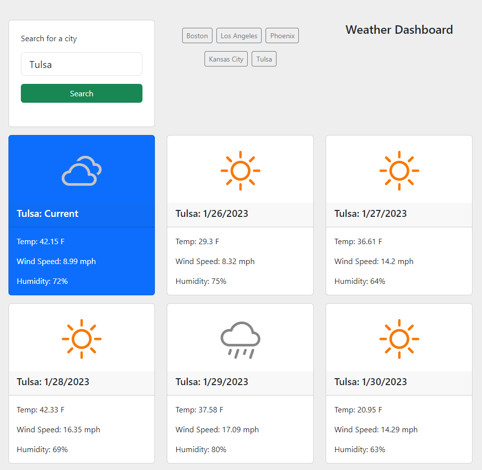

# Five Day Forecast

## Description
*Five Day Forecast* displays weather forecast data for a city of the user's choice.  It stores previous searches in local storage so forecasts persist between closing the browser and refreshing the page.  Previous results can be accessed by clicking buttons that automaticall populate for each city after a user's search.  The app utilizes the [OpenWeatherMap API](https://openweathermap.org/api) for data, and the [Bootstrap](https://getbootstrap.com/) UI library for styles and structure.

**Visit the application here**: [https://kitrath.github.io/five-day-forecast/](https://kitrath.github.io/five-day-forecast)

## Usage
Input the name of a city and press the search button.  You will receive the current weather forecast in a card below the search area. You will also receive the forecast for each of the next five days.  Forecasts for cities you have searched are saved in your browser's local storage for three hours. Click on the button with the name of a city you have previously searched to see its weather forecast again.

## Screenshot

## Roadmap
- Notify the user of application errors with a Bootstrap modal component rather the a native browser alert.
- Develop application logic so that users can see midday forecasts by default for any city they choose, no matter the timezone.
- Apply navigation on each five day forecast card so that users can click back and forward through that day's forecasts at three hour intervals.
- Test and futher develop the caching logic for keeping forecasts in the browser's local storage.
